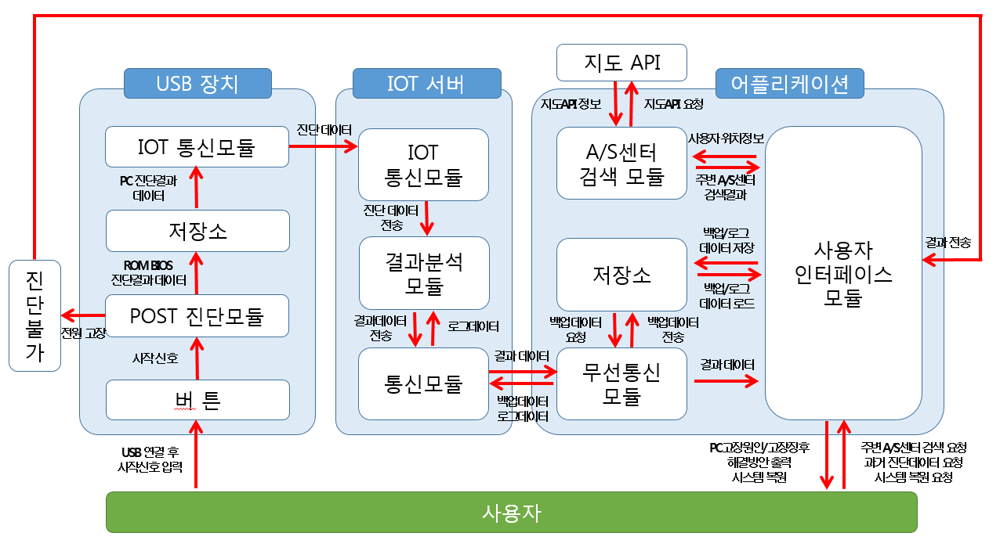

Team 5, 김병찬(nemoland0506), 권혁찬(gurckscks), 백규민(ddj4909)
# 컴퓨터 고장 자가진단 시스템

***목 차**
1. 문제상황
2. 조사분석 내용
3. 요구사항 및 진짜문제저의
4. 시스템 구조 설계 & 시스템 기능

컴퓨터가 **고장**이 나서 켜지지가 않아. 어떻게 하지?  
내가 **컴맹**이라서 고칠 수가 없네. 고쳐줄 **컴.잘.알** 친구가 없네.

우리를 도와줄 수 있는 프로그램은 무엇이 있을까?

1. 유사상용제품 : **POST 카드**..
               (Power On Self Test)

|제품 설명|
|---------|
|BIOS를 통해 메인보드와 연결된 주변장치의 상태를 체크하고  
숫자 LED를 통해 진단 코드를 출려한다.|

|장점|단점|
|----|----|
|연결 즉시 PC의 고장여부를 화긴할 수 있으나|고장 내용에 대해서는 바로 알 수 없고 일반인들은 더욱 알기 힘들다.|

2. 유사상용제품 : AIDA64 for Android

|제품 설명|
|---------|
|Android AIDA64는 하드웨어 및 소프트웨어에 대한 정보를 알려주며,  
휴대폰, 태블릿, TV 등 다양한 기기에 대한 진단정보르 표시해준다.|

|*장점*|*단점*|
|----|----|
|장치에 대한 진단정보를 한눈에 알아볼 수 있도록 구성된 UI가 특징이며,  
PC 뿐만이 아닌 다양한 기기에 대한 진단 정보를 나타낼수 있다.|    |

3.특허사례 : *Method and system for securing, managing or optimizing a personal computer*

**특허 설명**
자가진단 소프트웨어를 다운로드 받은 후 웹 상에서 자가진단을 실행하고, 결과를 확인할 수 있다.

|*장점*|*단점*|
|:---:|:---:|
|자동진단 프로그램을 다운로드 한 후 설치할 수 있다.|반드시 인터넷에 연결되어 있어야만한다.|

## 시스템 개요

컴맹이라도  PC가 고장이 났을 때 자동으로 PC를 진단하고, PC 고장의 원인과 해결방안을 알려주며,
USB장치 하나만으로도 사용할 수 있고, 특별한 조작 없이 자동으로 동작하는
쉽게 고장원인과 해결방안을 알려주는 **컴퓨터 자가진단 시스템**

 - 시스템 구성도

 1. POST 진단모듈
  - ROM BIOS 스캔 및 고장부위 진단기능
  - 메인보드 ROM BIOS의 내용을 읽어들이고 부팅시 실행되어 고장여부 진단
  - 문제발견시 BIOS에 대한 에러코드를 탐색하고 출력한다.

 2. IOT 통신모듈
  - LPWA 통신기능: IOT 전용통신 LPWA에서 데이터를 송수신한다.
 
 3. 결과분석 모듈
  - 해결방안 분석기능: 발견된 에러코드에 해당하는 고장원인과 방안을 분석한다.
  - 고장징후 분석기능: 로그데이터와 백업데이터를 분석하여 징후와 방안을 분석

 4. (무선)통신 모듈
  - 인터넷 통신기능: 인터넷 웹 상으로 데이터를 송수신한다.

 5. A/S센터 검색모듈
  - 주변 A/S센터 검색기능: 사용자의 위치정보를 바탕으로 주변의 A/S센터 검색

 6. 사용자 인터페이스 모듈
  - 앞선 모듈들을 사용자가 사용할 수 있도록 인터페이스 기능을 제공
